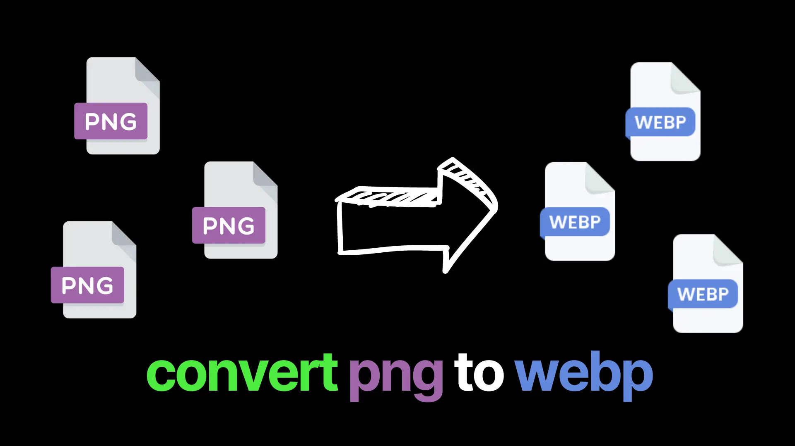

# PNG-to-WEBP



Python script to convert image files into webp. This works with all image types, not just PNGs.

# How to use

1.  Clone the repository.

```
git clone https://github.com/Calesi19/PNG-to-WEBP.git
```

2.  Navigate to the project directory.

```
cd PNG-to-WEBP
```

3. Create a virtual environment.

```
python -m venv venv
```

4. Activate the virtual environment.

On Windows:

```
.\venv\Scripts\activate
```

On Mac or Linux:

```
source venv/bin/activate
```

5. Install required packages.

```
pip install -r requirements.txt
```

6. Place your images into the "images" folder.

7. Run the script.

```
python script
```

8. Retrieve all your images from the "images_webp" folder.
